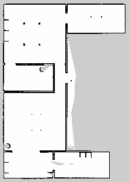

# SLAM and Path Planning

This file documents my learning and implementation journey with **ROS2**, **TurtleBot3**, **SLAM**, and **Path Planning** using simulation tools like **Gazebo** and **RViz**.

## 🚀 Progress Overview

### ✅ Mapping and Navigation
- Successfully generated **two environment maps** using:
  - `turtlebot3` in **Gazebo**
  - Visualization and navigation through **RViz**
  - ROS2 packages and tools (e.g., `slam_toolbox`, `nav2`, etc.)
- Enabled **autonomous navigation** of the robot through the mapped environments.

### 🔍 Nav2 Stack & Costmap Configuration
- Understood the structure and components of the **Nav2 stack**.
- Explored how:
  - The **costmap layers**
  - The **inflation radius**
  - Obstacle padding  
  affect the robot's ability to plan and execute paths toward a goal.

### 🧠 Path Planning Algorithms
- Studied and implemented basic **global** and **local** path planning strategies on the `turtlebot3`:
  - Global planners: e.g., A*, Dijkstra
  - Local planners: e.g., DWB, RPP
- Analyzed their behavior and effect on the robot’s movement.

### 📄 Research Exploration
- Read and understood the concepts behind the **Dynamic Window Approach (DWA)**.

---

## 🗺️ Map Generation Results

### Environment 1

### Environment 2

- Maps were generated using **SLAM Toolbox** in simulation with TurtleBot3 in Gazebo.
- Visualization and saving done via `ros2 run nav2_map_server map_saver_cli`.

---

## 📊 Planner Benchmark Comparisons

### 🔁 Global Planner Comparison: A\* vs Dijkstra

| Metric              | A*                | Dijkstra           |
|---------------------|-------------------|--------------------|
| Planning Time       | -----             | -----              |
| Path Length         | 4.3 m             | 4.5 m              |
| CPU Load (avg)      | Lower             | Slightly Higher    |
| Path Shape          | Direct            | Conservative       |

> A* was generally faster and produced more direct paths in both environments.
**Why?**  
A* uses a heuristic (usually Euclidean or Manhattan distance to the goal) to guide the search, allowing it to prioritize more promising paths. This results in faster planning and often shorter routes.  
In contrast, Dijkstra is a greedy, uniform-cost algorithm — it explores all directions equally without considering proximity to the goal, making it slower and less efficient in larger maps.
---

### 🔁 Local Planner Comparison: DWB vs Regulated Pure Pursuit (RPP)

| Metric              | DWB                          | Regulated Pure Pursuit (RPP)       |
|---------------------|------------------------------|------------------------------------|
| Obstacle Avoidance  | Very reactive (uses critics) | Smooth but can be less responsive |
| Path Smoothness     | Moderate                     | Very smooth                        |
| CPU Load            | Higher                       | Lower                              |
| Tuning Complexity   | High (critics, weights, etc) | Low (fewer parameters)             |

> DWB provided better control in tight areas and with dynamic obstacles but is harder to configure.  
> RPP worked well in open space and was easier to configure, but is used with primarily static obstacles and simple scenarios. 

--

- All benchmarks were collected using `/planner_server` and `/controller_server` in Nav2 stack.
- Timing was measured using simulation logs.

---

## 📚 References

- DWA description to reactive collision avoidance[Fox et al., 1997. Real-Time Obstacle Avoidance for Fast Mobile Robots.](https://www.ri.cmu.edu/pub_files/pub1/fox_dieter_1997_1/fox_dieter_1997_1.pdf)
- Nav2 Planner [docs](https://docs.nav2.org/setup_guides/algorithm/select_algorithm.html#selecting-the-algorithm-plugins)

---

## 🛠 Tools & Technologies
- ROS2 (Humble/Foxy)
- TurtleBot3
- Gazebo
- RViz
- Nav2
- SLAM Toolbox
